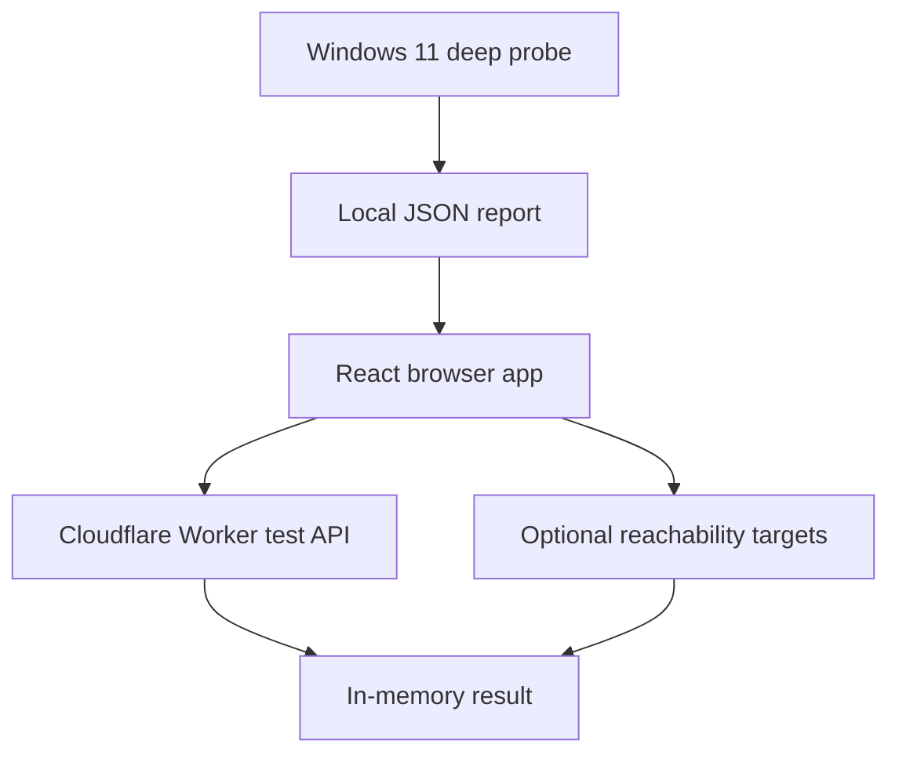

# Network Diagnostics Suite

[](https://github.com/JohnnyZLi/Network-Diagnostics-Suite/actions/workflows/ci.yml)
[](LICENSE)

A privacy-first connection-quality test that reports more than a headline download speed. The browser app measures throughput, latency distributions, jitter, request failures, loaded responsiveness, and common-service reachability. An optional Windows 11 probe adds operating-system-level packet loss, traceroute, DNS, path MTU, gateway, interface, and TCP/TLS diagnostics.

The project does not use accounts, cookies, analytics, advertising, telemetry, or a results database. Measurements remain in the current tab unless the user exports them.

## What it measures

| Measurement | Browser test | Windows deep probe |
| --- | :---: | :---: |
| Download and upload throughput | Yes | — |
| Mean, median, min, max, and p95 latency | Yes | Yes |
| Consecutive-sample jitter | Yes | Yes |
| Idle, download-loaded, and upload-loaded latency | Yes | — |
| Bufferbloat signal and project-specific grade | Yes | — |
| Browser request timeout rate | Yes | — |
| Raw ICMP packet loss | — | Yes |
| Traceroute with three samples per hop | — | Yes |
| Default-gateway latency | — | Yes |
| System, Cloudflare, Google, and Quad9 DNS timing | — | Yes |
| IPv4 path MTU estimate | — | Yes |
| DNS, TCP, and TLS connection phases | — | Yes |
| Interface link speed, MTU, and IP support | — | Yes |

The distinction is intentional: a browser cannot send arbitrary ICMP packets or run a truthful traceroute. Browser timeouts are therefore labeled **request loss**, never packet loss.

## Test profiles

| Profile | Approx. time | Download cap | Upload cap | Common-service checks |
| --- | ---: | ---: | ---: | :---: |
| Quick | 15 seconds | 100 MB | 32 MB | No |
| Full | 30 seconds | 300 MB | 96 MB | Yes |
| Stress | 45 seconds | 1 GB | 256 MB | Yes, with confirmation |

Caps are ceilings. A slower connection stops at the profile duration and transfers less data.

## Architecture



- **React and TypeScript** render the dashboard and run browser measurements.
- **Cloudflare Workers** serve the static app and same-origin latency, download, upload, and metadata endpoints.
- **.NET 10** powers a self-contained Windows 11 x64 command-line probe.
- Imported deep-probe JSON is read with the browser File API and is not uploaded.

## Run locally

Requirements: Node.js 24+, npm, and optionally the .NET 10 SDK.

```bash
npm install
npm run worker:dev
```

`worker:dev` builds the app and starts the Worker-backed local environment. `npm run dev` is useful for UI-only work, but the measurement endpoints will not exist in that mode.

Run the automated checks:

```bash
npm run typecheck
npm test
npm run build
npm run probe:test
```

## Windows deep probe

Build a self-contained Windows 11 x64 executable:

```bash
npm run probe:build
```

Run it from PowerShell or Windows Terminal:

```powershell
.\NetworkDeepProbe.exe
```

The probe writes a timestamped JSON report to the current directory. Import that report through the web dashboard to render the deep results.

```text
NetworkDeepProbe [options]

  --target <host>       Ping and traceroute target (default: 1.1.1.1)
  --output <file>       JSON report path
  --pings <5-100>       Internet ping count (default: 20)
  --max-hops <5-64>     Traceroute hop limit (default: 30)
  --include-addresses   Include local IP, gateway, DNS, and private-hop addresses
  --help                Show usage
```

Private and link-local traceroute hops are redacted by default. Interface addresses, gateway addresses, DNS addresses, public IP, MAC address, hostname, and SSID are also omitted by default. Public transit-hop addresses remain because they are the traceroute result.

## Privacy and accuracy

This project promises **no application-level retention**, not invisibility on the Internet. Cloudflare necessarily processes traffic sent to the Worker, and the opt-in common-service battery sends one request to each named provider. Those providers may process requests under their own policies.

See [Privacy model](docs/privacy.md) and [Measurement methodology](docs/methodology.md) for the complete data flow, formulas, grading thresholds, and limitations.

## Deployment

The recommended production location is `network.johnnyli.dev`, linked from the portfolio at `johnnyli.dev`. GitHub Pages can showcase or link to the project but cannot provide the dynamic upload/download endpoints, so the complete app is deployed as a Cloudflare Worker.

See [Deployment guide](docs/deployment.md) for the exact workflow, custom-domain setup, and production safeguards.

## Repository map

```text
src/                    React application and browser test engine
worker/                 Cloudflare Worker measurement endpoints
tools/DeepProbe/        Windows 11 network probe
tools/DeepProbe.Tests/  Probe unit tests
tests/                  Browser and Worker unit tests
docs/                   Methodology, privacy, and deployment notes
```

## License

[MIT](LICENSE) © 2026 Johnny Li
