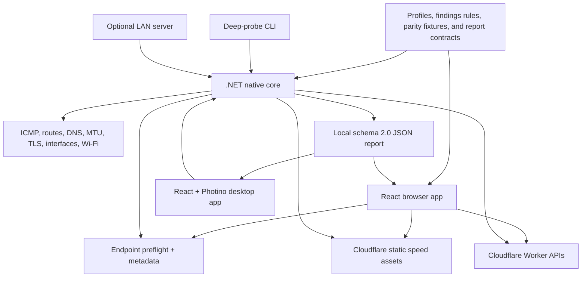

# Network Diagnostics Suite

[](https://github.com/JohnnyZLi/Network-Diagnostics-Suite/actions/workflows/ci.yml)
[](LICENSE)

A privacy-first connection-quality suite with three clients built around a shared measurement and report model:

- The **browser application** measures first-party Internet throughput, latency distributions, jitter, request failures, loaded responsiveness, bufferbloat, service reachability, endpoint preflight data, and deterministic findings.
- The **native desktop application** provides Connection, Quick, Full, and Stress profiles with Both, Single, and Aggregate topologies, then adds operating-system, LAN, interface, route, resolver, path, and protocol measurements.
- The **command-line deep probe** preserves scriptable ICMP, traceroute, DNS, path MTU, interface, Wi-Fi, routing, TCP/TLS, endpoint selection, HTTP/3, and optional two-machine LAN diagnostics.

The project does not use accounts, cookies, analytics, advertising, telemetry, or a project-operated results database. Browser measurements remain in that browser. Native reports are written to the user's computer. The primary transfer path uses project-controlled Cloudflare endpoints rather than publishing results to a public speed-test dataset.

## Download the desktop app

The desktop packages are self-contained; installing .NET is not required. Choose the package that matches the operating system and processor:

| System | Architecture | Download | Verify |
| --- | --- | --- | --- |
| Windows | x64 | [](https://github.com/JohnnyZLi/Network-Diagnostics-Suite/releases/latest/download/NetworkDiagnosticsDesktop-win-x64.zip) | [SHA-256](https://github.com/JohnnyZLi/Network-Diagnostics-Suite/releases/latest/download/NetworkDiagnosticsDesktop-win-x64.zip.sha256) |
| macOS 12+ | Apple Silicon | [](https://github.com/JohnnyZLi/Network-Diagnostics-Suite/releases/latest/download/NetworkDiagnosticsDesktop-osx-arm64.tar.gz) | [SHA-256](https://github.com/JohnnyZLi/Network-Diagnostics-Suite/releases/latest/download/NetworkDiagnosticsDesktop-osx-arm64.tar.gz.sha256) |
| macOS 12+ | Intel | [](https://github.com/JohnnyZLi/Network-Diagnostics-Suite/releases/latest/download/NetworkDiagnosticsDesktop-osx-x64.tar.gz) | [SHA-256](https://github.com/JohnnyZLi/Network-Diagnostics-Suite/releases/latest/download/NetworkDiagnosticsDesktop-osx-x64.tar.gz.sha256) |
| Linux | x64 | [](https://github.com/JohnnyZLi/Network-Diagnostics-Suite/releases/latest/download/NetworkDiagnosticsDesktop-linux-x64.tar.gz) | [SHA-256](https://github.com/JohnnyZLi/Network-Diagnostics-Suite/releases/latest/download/NetworkDiagnosticsDesktop-linux-x64.tar.gz.sha256) |
| Linux | ARM64 | [](https://github.com/JohnnyZLi/Network-Diagnostics-Suite/releases/latest/download/NetworkDiagnosticsDesktop-linux-arm64.tar.gz) | [SHA-256](https://github.com/JohnnyZLi/Network-Diagnostics-Suite/releases/latest/download/NetworkDiagnosticsDesktop-linux-arm64.tar.gz.sha256) |

These portable builds are currently unsigned. On macOS, try opening **Network Diagnostics.app** normally, then use **System Settings → Privacy & Security → Open Anyway** if Gatekeeper blocks it. See [all releases](https://github.com/JohnnyZLi/Network-Diagnostics-Suite/releases) and the [desktop package guide](tools/NetworkDiagnostics.Desktop/DISTRIBUTION.md) for launch and privacy details.

## Design system

The browser application consumes Johnny Li Web Design System v1.9.0 from the immutable source recorded in `design-system.lock.json` and `src/design-system/SOURCE.md`. Continuous integration verifies the committed tokens, shared foundations, navigation controllers, conformance contract, and integration data against that exact source.

The desktop application uses a dedicated React + TypeScript + Vite workbench embedded in Photino.NET. Photino owns the cross-platform native window and .NET bridge; the frontend provides the compact desktop interaction model, keyboard navigation, accessibility states, and System/Light/Dark themes.

## What it measures

| Measurement | Browser | Native desktop | Deep-probe CLI |
| --- | :---: | :---: | :---: |
| First-party Internet download and upload | Yes | Yes | Opt-in |
| Quick, Full, and Stress profiles | Yes | Yes | Opt-in |
| Low-data Connection Check | — | Yes | Opt-in |
| Both/Compare, Single, and Aggregate topologies | Yes | Yes | Opt-in |
| Single-flow and aggregate results | Yes | Yes | Opt-in |
| Stress 1, 2, 4, 8, and 10 connection scaling | Yes | Yes | Opt-in |
| Idle and loaded latency | Yes | Yes | With Internet transfer |
| Mean, median, min, max, p95, and jitter | Yes | Yes | Yes |
| Browser request loss | Yes | — | — |
| Raw ICMP packet loss | — | Full/Stress | Yes |
| Default-gateway latency | — | Full/Stress | Yes |
| Traceroute with three samples per hop | — | Full/Stress | Yes |
| DNS resolver timing | — | Full/Stress | Yes |
| IPv4 path MTU estimate | — | Full/Stress | Yes |
| DNS, TCP, and TLS connection phases | — | Full/Stress | Yes |
| Interface link speed, MTU, and IP support | — | Yes | Yes |
| Selectable source interface | — | Yes | Yes |
| Wi-Fi signal, channel, band, and link rates | — | When exposed by the OS | When exposed by the OS |
| Route-table and default-route details | — | When exposed by the OS | When exposed by the OS |
| Endpoint latency preflight and selection data | Yes | Yes | With Internet transfer |
| Edge, network, ASN, protocol, TLS, and IP-version metadata | Yes | Yes | With Internet transfer |
| Measurement-backed findings and suggested next steps | Yes | Yes | With Internet transfer |
| Exact HTTP/3 request | — | Yes | With Internet transfer |
| Observed browser HTTP protocol | Yes | Imported as evidence | — |
| Isolated two-machine LAN throughput | — | Yes | Yes |

A browser cannot send arbitrary ICMP packets or run a truthful traceroute. Browser timeouts are therefore labeled **request loss**, never packet loss. Unsupported native fields are reported as **Not measured** rather than guessed.

## Profiles and data ceilings

The browser keeps its approved Quick, Full, and Stress profiles. The native desktop and CLI add a separate low-data Connection Check.

| Native profile | Base estimate | Download cap | Upload cap | Maximum combined transfer | Deep OS diagnostics |
| --- | ---: | ---: | ---: | ---: | :---: |
| Connection Check | 15 seconds | 20 MB | 8 MB | 28 MB | No |
| Quick | 20 seconds | 600 MB | 128 MB | 728 MB | No |
| Full | 35 seconds | 900 MB | 256 MB | 1.156 GB | Yes |
| Stress | 60 seconds | 3 GB | 512 MB | 3.512 GB | Yes |

Caps are ceilings. Slower connections stop at the stage duration and transfer less data. Compare can require longer than the base estimate because it runs independent single and aggregate stages. Each client calculates and displays the selected plan's actual estimate and transfer ceiling before starting. Full and Stress require explicit data-use confirmation.

Concurrent native download workers reserve bytes before reading, so committed measured payload cannot exceed the configured stage ceiling.

## Endpoint and interface behavior

Before a test, the browser and native engine probe configured endpoint candidates and select the lowest-latency available origin. Selection evidence, candidate failures, edge location, network name, ASN, negotiated protocol, TLS version, and IP version are stored in schema 2.0 reports when available.

- The browser always includes the primary website origin and may receive additional candidates through `VITE_NDS_ENDPOINTS`.
- The desktop accepts up to eight endpoint origins in Settings.
- The CLI accepts repeated `--test-origin <url>` arguments, up to eight candidates.

The desktop and CLI can select an active network interface. HTTP/1.1 and HTTP/2 transfer sockets plus LAN sockets are bound to that interface's source address. Managed ICMP, traceroute, DNS, and the exact HTTP/3 request remain routed by the operating system because portable source-interface binding is not available for those APIs. Reports disclose that scope rather than implying complete interface isolation.

## HTTP/3 evidence

The native engine sends a separate HTTPS request with HTTP version 3.0 and an exact-version policy. Success, negotiated protocol, duration, and safe failure text are stored in the measurement context. Failure does not invalidate ordinary HTTP/1.1 or HTTP/2 throughput results.

Browsers do not expose a portable exact-version request API. The web client records the protocol observed through Navigation Timing instead; that evidence is observational and is not presented as a forced HTTP/3 test.

## Architecture


```mermaid
flowchart TD
    Contract["Profiles, findings rules, parity fixtures, and report contracts"] --> Browser["React browser app"]
    Contract --> Core[".NET native core"]
    Browser --> Preflight["Endpoint preflight + metadata"]
    Browser --> Assets["Cloudflare static speed assets"]
    Browser --> Worker["Cloudflare Worker APIs"]
    Desktop["React + Photino desktop app"] --> Core
    CLI["Deep-probe CLI"] --> Core
    Core --> Preflight
    Core --> Assets
    Core --> Worker
    Core --> OS["ICMP, routes, DNS, MTU, TLS, interfaces, Wi-Fi"]
    LanServer["Optional LAN server"] --> Core
    Core --> Report["Local schema 2.0 JSON report"]
    Report --> Desktop
    Report --> Browser
```

- **React and TypeScript** render the browser dashboard and run browser measurements.
- **Cloudflare Workers Static Assets** and optional R2 delivery provide deterministic first-party download payloads.
- **Cloudflare Workers** provide same-origin latency, upload, metadata, and fallback download endpoints.
- **NetworkDiagnostics.Core on .NET 10** owns native planning, endpoint selection, Internet transfers, deep diagnostics, platform capability reporting, findings, and report serialization.
- **Photino.NET** embeds the React workbench in a native Windows, macOS, and Linux host and connects it to the shared .NET engine.
- **Shared parity fixtures** verify that the TypeScript and C# findings engines produce the same finding IDs for representative reports.
- Imported native JSON is read locally by the browser File API and is not uploaded.

## Run locally

Requirements: Node.js 24+, npm, and the .NET 10 SDK for native work.

```bash
npm install
npm run worker:dev
```

The web build creates ignored deterministic speed payloads under `public/speed/` and copies them into `dist/`. `worker:dev` starts the Worker-backed local environment. `npm run dev` is useful for UI work but does not provide the dynamic measurement endpoints.

Run the main checks:

```bash
npm run design-system:check
npm run design-system:integration
npm run design-system:conformance
npm run typecheck
npm test
npm run build
npm run probe:test
```

Build all native targets:

```bash
npm run probe:build
npm run desktop:build
```

Individual scripts such as `npm run probe:build:mac-arm64` and `npm run desktop:build:linux-x64` build one target.

## Native desktop application

Tagged desktop versions are retained on [GitHub Releases](https://github.com/JohnnyZLi/Network-Diagnostics-Suite/releases) using the direct downloads above. The [Desktop app workflow](https://github.com/JohnnyZLi/Network-Diagnostics-Suite/actions/workflows/desktop.yml) also publishes 30-day development artifacts for relevant commits and pull requests:

| Artifact | Intended system |
| --- | --- |
| `NetworkDiagnosticsDesktop-win-x64` | Windows 11 x64 |
| `NetworkDiagnosticsDesktop-osx-arm64` | Apple Silicon macOS |
| `NetworkDiagnosticsDesktop-osx-x64` | Intel macOS |
| `NetworkDiagnosticsDesktop-linux-x64` | glibc Linux x64 |
| `NetworkDiagnosticsDesktop-linux-arm64` | glibc Linux ARM64 |

Each package contains the self-contained app, license, run/privacy notes, and a SHA-256 checksum. The application provides:

- Connection, Quick, Full, and Stress profiles;
- Both, Single, and Aggregate transfer topologies;
- Automatic, Direct R2, and Worker download paths;
- pre-test endpoint, network, edge, interface, route, delivery-path, and HTTP/3 measurements;
- selectable source interface with documented binding scope;
- computed time, cap, connection, and run summaries;
- live progress, cancellation, and partial-result preservation;
- findings, measurements, and suggested next tests;
- single-versus-aggregate and Stress scaling results;
- interface, Wi-Fi, routing, DNS, TLS, MTU, and traceroute views;
- LAN server and LAN-target client controls;
- local report history, reopen, import, and export;
- passive network-health monitoring with local history and exports;
- Advanced Diagnostics for endpoint, binding, privacy, preflight, and LAN workflows;
- persisted profile, topology, download path, privacy, endpoint, interface, LAN, and data-approval settings.

macOS CI artifacts are valid `.app` bundles but are not Apple-signed or notarized. Review the source and checksum, build locally, or explicitly approve the app in **System Settings → Privacy & Security**. Do not disable Gatekeeper globally.

## Command-line deep probe

The [Native probe workflow](https://github.com/JohnnyZLi/Network-Diagnostics-Suite/actions/workflows/native-probe.yml) builds the scriptable `NetworkDeepProbe` executable for the same five runtime targets. Running it without transfer options preserves the lower-data deep-diagnostics workflow and writes schema 1.2 JSON.

```text
NetworkDeepProbe [options]

Deep diagnostics:
  --target <host>       Ping and traceroute target (default: 1.1.1.1)
  --output <file>       JSON report path
  --pings <5-100>       Internet ping count (default: 20)
  --max-hops <5-64>     Traceroute hop limit (default: 30)
  --include-addresses   Include local addresses, routes, and SSID
  --interface <id>      Source-bind supported HTTP and LAN sockets

First-party Internet transfer:
  --internet-transfer   Add native Internet download/upload measurements
  --profile <name>      connection-check, quick, full, or stress
  --transfer-method <m> compare, single, or aggregate
  --test-origin <url>   Endpoint candidate; repeat up to eight times

Local-link isolation:
  --lan-server          Run the LAN throughput server until Ctrl+C
  --lan-target <host>   Test a machine running --lan-server
  --lan-port <port>     TCP port (default: 8765)
  --lan-duration <3-30> Seconds per direction (default: 8)
  --lan-streams <1-16>  Parallel streams (default: 4)
```

`--internet-transfer` emits the combined schema 2.0 report with endpoint, capability, interface, network, HTTP/3, and finding evidence. The default deep-only run emits schema 1.2. The browser importer continues to accept native schemas 1.0, 1.1, 1.2, and 2.0.

### Isolate the local network

On a preferably wired machine on the same trusted LAN, start the desktop LAN server or run:

```bash
./NetworkDeepProbe --lan-server
```

On the device being tested, use the desktop LAN target controls or run:

```bash
./NetworkDeepProbe --lan-target 192.168.1.10
```

Fast LAN plus slower Internet points away from Wi-Fi or Ethernet as the primary bottleneck. Slow LAN means the local link, device, switch, access point, server, or adapters can be limiting the Internet result. LAN mode removes the ISP, public transit, and public test server; it does not remove either endpoint machine.

Permit the selected TCP port through the server firewall only on trusted networks and stop the server afterward.

## Reports and compatibility

New browser and native exports use schema 2.0. The desktop also normalizes older raw browser exports. The browser accepts desktop reports with or without deep diagnostics. Unknown optional fields are ignored, and absent native-only sections are shown as **Not measured**.

Reports may include:

- producer and engine identity;
- profile, transfer method, plan, caps, and timestamps;
- endpoint candidate and selection evidence;
- selected-interface and binding-scope evidence;
- edge/network/ASN/protocol/TLS/IP-version metadata;
- exact native HTTP/3 evidence;
- Internet transfer, deep diagnostics, and optional LAN results;
- deterministic findings, confidence, evidence, recommendations, and next tests.

## Privacy and accuracy

The main speed path contacts only configured project or user-supplied endpoints. Cloudflare necessarily processes traffic sent to the default endpoint. Full and Stress service checks also contact the named providers. The project promises no application-level server retention, not invisibility on the Internet.

Native reports hide local interface addresses, gateways, resolver addresses, private route details, hostname, public IP, MAC address, and SSID by default. Enabling local identifiers makes the report sensitive diagnostic material. Public traceroute hops and hardware/interface descriptions can still reveal network context.

Endpoint overrides and LAN targets are advanced controls. Only use endpoints and LAN servers you trust. Results from different providers or regions are not directly interchangeable unless their payload and server behavior are comparable.

See [Privacy model](docs/privacy.md) and [Measurement methodology](docs/methodology.md) for the complete data flow, formulas, grading thresholds, and limitations.

## Deployment

The complete browser application is deployed as a Cloudflare Worker with bundled static assets at `network.johnnyli.dev`. A `desktop-vX.Y.Z` tag builds all five desktop targets, verifies their archives and checksums, and publishes an unsigned portable GitHub Release.

A protected manual workflow is prepared for Apple Developer ID signing, notarization, stapling, and signed DMG creation after release credentials are configured.

See [Deployment guide](docs/deployment.md) for Cloudflare configuration and production safeguards.

## Repository map

```text
contracts/                           Profiles, rules, parity fixtures, and reports
src/                                 React application and browser test engine
worker/                              Cloudflare Worker measurement endpoints
scripts/                             Build, conformance, and asset tooling
public/speed/                        Generated first-party payloads (ignored)
tools/NetworkDiagnostics.Core/       Shared native planning and diagnostics
tools/NetworkDiagnostics.Desktop/    Cross-platform graphical application
tools/DeepProbe/                     Backward-compatible command-line host
tools/DeepProbe.Tests/               Native unit and contract tests
tests/                               Browser and Worker tests
docs/                                Methodology, privacy, architecture, deployment
```

## License

[MIT](LICENSE) © 2026 Johnny Li
