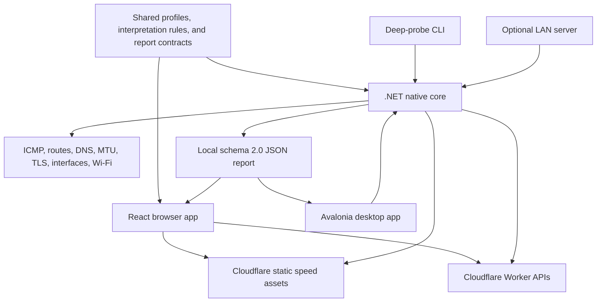

# Network Diagnostics Suite

[](https://github.com/JohnnyZLi/Network-Diagnostics-Suite/actions/workflows/ci.yml)
[](LICENSE)

A privacy-first connection-quality suite with three clients built around the same measurement model:

- The **browser application** measures first-party Internet throughput, latency distributions, jitter, request failures, loaded responsiveness, bufferbloat, and service reachability.
- The **native desktop application** adds the same Connection Check, Full, Stress and Compare, Single, Aggregate test concepts to a cross-platform graphical interface, then combines them with operating-system diagnostics.
- The **command-line deep probe** preserves scriptable ICMP, traceroute, DNS, path MTU, interface, Wi-Fi, routing, TCP/TLS, and optional two-machine LAN diagnostics.

The project does not use accounts, cookies, analytics, advertising, telemetry, or a project-operated results database. Browser measurements remain in that browser. Native reports are written to the user's computer. The primary transfer path uses the project's own Cloudflare deployment rather than publishing results to a public speed-test dataset.

## Design system

The browser application consumes Johnny Li Web Design System v1.8.2 from the immutable source recorded in `design-system.lock.json` and `src/design-system/SOURCE.md`. Continuous integration verifies the committed tokens, shared foundations, navigation controllers, conformance contract, and integration evidence against that exact source.

The desktop application translates the same approved product hierarchy and restrained terracotta/neutral visual language into native controls. Platform menus, window behavior, focus, keyboard navigation, accessibility, and high-contrast behavior remain owned by the native UI framework rather than reproducing browser markup.

## What it measures

| Measurement | Browser | Native desktop | Deep-probe CLI |
| --- | :---: | :---: | :---: |
| First-party Internet download and upload | Yes | Yes | Opt-in |
| Connection Check, Full, and Stress profiles | Yes | Yes | Opt-in |
| Compare, Single, and Aggregate methods | Yes | Yes | Opt-in |
| Single-flow and aggregate results | Yes | Yes | Opt-in |
| Stress 1, 2, 4, 8, and 10 connection scaling | Yes | Yes | Opt-in |
| Idle and loaded latency | Yes | Yes | With Internet transfer |
| Mean, median, min, max, p95, and jitter | Yes | Yes | Yes |
| Browser request loss | Yes | — | — |
| Raw ICMP packet loss | — | Yes | Yes |
| Default-gateway latency | — | Yes | Yes |
| Traceroute with three samples per hop | — | Yes | Yes |
| DNS resolver timing | — | Yes | Yes |
| IPv4 path MTU estimate | — | Yes | Yes |
| DNS, TCP, and TLS connection phases | — | Yes | Yes |
| Interface link speed, MTU, and IP support | — | Yes | Yes |
| Wi-Fi signal, channel, band, and link rates | — | When exposed by the OS | When exposed by the OS |
| Route-table and default-route details | — | When exposed by the OS | When exposed by the OS |
| Isolated two-machine LAN throughput | — | Optional | Optional |
| Evidence-backed findings and next tests | Yes | Yes | With Internet transfer |
| Selected endpoint, engine, and capability metadata | Yes | Yes | With Internet transfer |

A browser cannot send arbitrary ICMP packets or run a truthful traceroute. Browser timeouts are therefore labeled **request loss**, never packet loss. Unsupported native fields are reported as unavailable rather than guessed.

## Test profiles

| Profile | Browser base estimate | Download cap | Upload cap | Maximum combined transfer | Service checks |
| --- | ---: | ---: | ---: | ---: | :---: |
| Connection Check (`quick`) | 15 seconds | 20 MB | 8 MB | 28 MB | No |
| Full | 35 seconds | 900 MB | 256 MB | 1.156 GB | Yes |
| Stress | 60 seconds | 3 GB | 512 MB | 3.512 GB | Yes |

Caps are ceilings. Slower connections stop at the stage duration and transfer less data. Connection Check deliberately uses the first-party Worker path without transfer warm-up so its browser run remains within the lightweight ceiling. Compare can require longer than the base estimate because it runs independent single and aggregate stages. Each client calculates and displays the selected plan's actual estimate and transfer ceiling before starting. Full and Stress require an explicit data-use confirmation.

## Architecture


```mermaid
flowchart TD
    Contract["Shared profiles, interpretation rules, and report contracts"] --> Browser["React browser app"]
    Contract --> Core[".NET native core"]
    Browser --> Assets["Cloudflare static speed assets"]
    Browser --> Worker["Cloudflare Worker APIs"]
    Desktop["Avalonia desktop app"] --> Core
    CLI["Deep-probe CLI"] --> Core
    Core --> Assets
    Core --> Worker
    Core --> OS["ICMP, routes, DNS, MTU, TLS, interfaces, Wi-Fi"]
    LanServer["Optional LAN server"] --> Core
    Core --> Report["Local schema 2.0 JSON report"]
    Report --> Desktop
    Report --> Browser
```

- **React and TypeScript** render the browser dashboard and run browser measurements.
- **Cloudflare Workers Static Assets** and optional R2 delivery provide deterministic first-party download payloads.
- **Cloudflare Workers** provide same-origin latency, upload, metadata, and fallback download endpoints.
- **NetworkDiagnostics.Core on .NET 10** owns native planning, Internet transfers, deep diagnostics, platform capability reporting, and report serialization.
- **Versioned interpretation rules** produce evidence, confidence, recommendations, and a suggested next test in both engines without inventing a universal health score.
- **Avalonia** provides the Windows, macOS, and Linux desktop host.
- Imported native JSON is read locally by the browser File API and is not uploaded.

## Run locally

Requirements: Node.js 24+, npm, and the .NET 10 SDK for native work.

```bash
npm install
npm run worker:dev
```

The web build creates ignored deterministic speed payloads under `public/speed/` and copies them into `dist/`. `worker:dev` starts the Worker-backed local environment. `npm run dev` is useful for UI work but does not provide the dynamic measurement endpoints.

Run the main checks:

```bash
npm run design-system:check
npm run design-system:integration
npm run design-system:conformance
npm run typecheck
npm test
npm run build
npm run probe:test
```

Build all native targets:

```bash
npm run probe:build
npm run desktop:build
```

Individual scripts such as `npm run probe:build:mac-arm64` and `npm run desktop:build:linux-x64` build one target.

## Native desktop application

The [Desktop app workflow](https://github.com/JohnnyZLi/Network-Diagnostics-Suite/actions/workflows/desktop.yml) publishes these 30-day artifacts when desktop, shared-core, or contract files change:

| Artifact | Intended system |
| --- | --- |
| `NetworkDiagnosticsDesktop-win-x64` | Windows 11 x64 |
| `NetworkDiagnosticsDesktop-osx-arm64` | Apple Silicon macOS |
| `NetworkDiagnosticsDesktop-osx-x64` | Intel macOS |
| `NetworkDiagnosticsDesktop-linux-x64` | glibc Linux x64 |
| `NetworkDiagnosticsDesktop-linux-arm64` | glibc Linux ARM64 |

Each package contains the self-contained binary, license, run/privacy notes, and a SHA-256 checksum. The application provides:

- profile and transfer-method selection;
- computed time, cap, connection, and run summaries;
- progress and cancellation;
- headline transfer, latency, and packet-loss metrics;
- evidence-backed findings with confidence, supporting measurements, and next actions;
- single-versus-aggregate and Stress scaling results;
- interface, Wi-Fi, routing, DNS, TLS, MTU, and traceroute views;
- optional LAN-target testing;
- the latest 12 local reports and export copies.

Windows:

```powershell
.\NetworkDiagnosticsDesktop.exe
```

macOS or Linux:

```bash
chmod +x NetworkDiagnosticsDesktop
./NetworkDiagnosticsDesktop
```

The initial macOS CI builds are not Apple-signed or notarized. Review the source and checksum, build locally, or explicitly approve the binary in **System Settings → Privacy & Security**. Do not disable Gatekeeper globally.

## Command-line deep probe

The [Native probe workflow](https://github.com/JohnnyZLi/Network-Diagnostics-Suite/actions/workflows/native-probe.yml) builds the scriptable `NetworkDeepProbe` executable for the same five runtime targets. Running it without transfer options preserves the lower-data deep-diagnostics workflow and writes schema 1.2 JSON.

```text
NetworkDeepProbe [options]

Deep diagnostics:
  --target <host>       Ping and traceroute target (default: 1.1.1.1)
  --output <file>       JSON report path
  --pings <5-100>       Internet ping count (default: 20)
  --max-hops <5-64>     Traceroute hop limit (default: 30)
  --include-addresses   Include local addresses, routes, and SSID

First-party Internet transfer:
  --internet-transfer   Add native Internet download/upload measurements
  --profile <name>      quick (Connection Check), full, or stress
  --transfer-method <m> compare, single, or aggregate
  --test-origin <url>   Candidate endpoint; repeat to select the lowest-latency available origin

Local-link isolation:
  --lan-server          Run the LAN throughput server until Ctrl+C
  --lan-target <host>   Test a machine running --lan-server
  --lan-port <port>     TCP port (default: 8765)
  --lan-duration <3-30> Seconds per direction (default: 8)
  --lan-streams <1-16>  Parallel streams (default: 4)
```

`--internet-transfer` emits the combined schema 2.0 report, including engine capabilities, endpoint preflight evidence, and deterministic findings. The default deep-only run emits schema 1.2. The browser importer continues to accept native schemas 1.0, 1.1, 1.2, and 2.0.

### Isolate the local network

On a preferably wired machine on the same trusted LAN:

```bash
./NetworkDeepProbe --lan-server
```

On the device being tested:

```bash
./NetworkDeepProbe --lan-target 192.168.1.10
```

Fast LAN plus slower Internet points away from Wi-Fi or Ethernet as the primary bottleneck. Slow LAN means the local link, device, switch, access point, server, or adapters can be limiting the Internet result. The LAN mode removes the ISP, public transit, and public test server; it does not remove either endpoint machine.

Permit the selected TCP port through the server firewall only on trusted networks and stop the server with Ctrl+C afterward.

## Privacy and accuracy

The main speed path contacts only project-operated first-party endpoints. Cloudflare necessarily processes the connection and traffic. Full and Stress service checks also contact the named providers. The project promises no application-level server retention, not invisibility on the Internet.

Native reports hide local interface addresses, gateways, resolver addresses, private route details, hostname, public IP, MAC address, and SSID by default. Enabling local identifiers makes the report sensitive diagnostic material. Public traceroute hops and hardware/interface descriptions can still reveal network context.

See [Privacy model](docs/privacy.md) and [Measurement methodology](docs/methodology.md) for the complete data flow, formulas, grading thresholds, and limitations.

## Deployment

The complete browser application is deployed as a Cloudflare Worker with bundled static assets at `network.johnnyli.dev`. GitHub Actions builds and packages native artifacts but does not sign or automatically publish an installer release.

See [Deployment guide](docs/deployment.md) for Cloudflare configuration and production safeguards.

## Repository map

```text
contracts/                           Shared profile and report contracts
src/                                 React application and browser test engine
worker/                              Cloudflare Worker measurement endpoints
scripts/                             Build, conformance, and asset tooling
public/speed/                        Generated first-party payloads (ignored)
tools/NetworkDiagnostics.Core/       Shared native planning and diagnostics
tools/NetworkDiagnostics.Desktop/    Cross-platform graphical application
tools/DeepProbe/                     Backward-compatible command-line host
tools/DeepProbe.Tests/               Native unit and contract tests
tests/                               Browser and Worker tests
docs/                                Methodology, privacy, architecture, deployment
```

## License

[MIT](LICENSE) © 2026 Johnny Li
