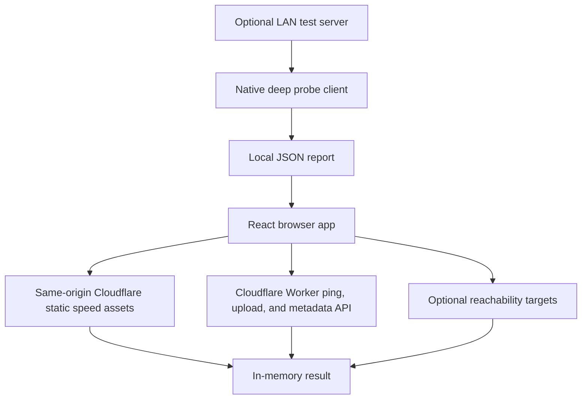

# Network Diagnostics Suite

[](https://github.com/JohnnyZLi/Network-Diagnostics-Suite/actions/workflows/ci.yml)
[](LICENSE)

A privacy-first connection-quality test that reports more than a headline download speed. The browser app measures throughput, latency distributions, jitter, request failures, loaded responsiveness, and common-service reachability. An optional native probe for Windows 11, macOS, and Linux adds operating-system-level packet loss, traceroute, DNS, path MTU, gateway, interface, TCP/TLS diagnostics, and an optional two-machine LAN throughput test that removes the public test server and ISP path.

The project does not use accounts, cookies, analytics, advertising, telemetry, or a results database. Measurements remain in the current tab unless the user exports them. The primary browser test stays on the project's own Cloudflare deployment rather than sending results to a public speed-test dataset.

## Design system

The browser application consumes Johnny Li Web Design System v1.5.0 from the immutable source recorded in `src/design-system/SOURCE.md`. CI verifies the committed tokens, shared foundations, canonical owned-site registry, Sites-menu controller, compact header-menu shell, and integration contract against that source.

The current production UI is the approved Network Diagnostics baseline. Network-specific hero composition, charts, measurements, test controls, progress states, report layouts, and semantic data encodings remain owned by this repository. The shared controller now owns outside-click, Escape, ArrowUp, ArrowDown, Home, End, focus restoration, and compact-navigation disclosure behavior. Shared page-content utilities remain available for future components, but stable application markup does not need to be rewritten solely to adopt shared class names.

## What it measures

| Measurement | Browser test | Native deep probe |
| --- | :---: | :---: |
| Internet download and upload throughput | Yes | — |
| Isolated LAN download and upload throughput | — | Yes, with two machines |
| Mean, median, min, max, and p95 latency | Yes | Yes |
| Consecutive-sample jitter | Yes | Yes |
| Idle, download-loaded, and upload-loaded latency | Yes | — |
| Bufferbloat signal and project-specific grade | Yes | — |
| Browser request timeout rate | Yes | — |
| Raw ICMP packet loss | — | Yes |
| Traceroute with three samples per hop | — | Yes |
| Default-gateway latency | — | Yes |
| System, Cloudflare, Google, and Quad9 DNS timing | — | Yes |
| IPv4 path MTU estimate | — | Yes |
| DNS, TCP, and TLS connection phases | — | Yes |
| Interface link speed, MTU, and IP support | — | Yes |

The distinction is intentional: a browser cannot send arbitrary ICMP packets or run a truthful traceroute. Browser timeouts are therefore labeled **request loss**, never packet loss.

## Test profiles

| Profile | Approx. time | Download cap | Upload cap | Maximum combined transfer | Common-service checks |
| --- | ---: | ---: | ---: | ---: | :---: |
| Quick | 20 seconds | 600 MB | 128 MB | 728 MB | No |
| Full | 35 seconds | 900 MB | 256 MB | 1.156 GB | Yes |
| Stress | 60 seconds | 3 GB | 512 MB | 3.512 GB | Yes, with confirmation |

Caps are ceilings. A slower connection stops at the profile duration and transfers less data. The interface shows each profile's maximum combined transfer in the selector and repeats the selected maximum before a run begins; Full and Stress require an explicit acknowledgment. Avoid these tests on metered or cellular connections unless that data use is acceptable.

## Architecture


```mermaid
flowchart TD
    Browser["React browser app"] --> Assets["Same-origin Cloudflare static speed assets"]
    Browser --> Worker["Cloudflare Worker ping, upload, and metadata API"]
    Browser --> Services["Optional reachability targets"]
    LanServer["Optional LAN test server"] --> Probe["Native deep probe client"]
    Probe --> Report["Local JSON report"]
    Report --> Browser
    Assets --> Result["In-memory result"]
    Worker --> Result
    Services --> Result
```

- **React and TypeScript** render the dashboard and run browser measurements.
- **Cloudflare Workers Static Assets** deliver two deterministic 24 MiB incompressible files directly from the edge for download testing, without invoking the Worker script for matching requests.
- **Cloudflare Workers** provide same-origin latency, upload, metadata, and fallback download endpoints.
- **.NET 10** powers self-contained command-line probes for Windows, macOS, and Linux, including a local TCP throughput server/client mode.
- Imported deep-probe JSON is read with the browser File API and is not uploaded.

## Run locally

Requirements: Node.js 24+, npm, and optionally the .NET 10 SDK.

```bash
npm install
npm run worker:dev
```

The build creates two ignored deterministic speed payloads under `public/speed/` and copies them into `dist/`. `worker:dev` then starts the Worker-backed local environment. `npm run dev` is useful for UI work and also generates the static payloads, but the dynamic measurement endpoints do not exist in that mode.

Run the automated checks:
